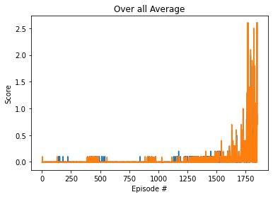
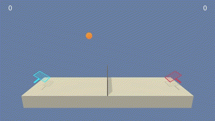

# Problem statement
In this environment, two agents control rackets to bounce a ball over a net. If an agent hits the ball over the net, it receives a reward of +0.1.  If an agent lets a ball hit the ground or hits the ball out of bounds, it receives a reward of -0.01.  Thus, the goal of each agent is to keep the ball in play.

The observation space consists of 8 variables corresponding to the position and velocity of the ball and racket. Each agent receives its own, local observation.  Two continuous actions are available, corresponding to movement toward (or away from) the net, and jumping. 

The task is episodic, and in order to solve the environment, your agents must get an average score of +0.5 (over 100 consecutive episodes, after taking the maximum over both agents). Specifically,

- After each episode, we add up the rewards that each agent received (without discounting), to get a score for each agent. This yields 2 (potentially different) scores. We then take the maximum of these 2 scores.
- This yields a single **score** for each episode.

The environment is considered solved, when the average (over 100 episodes) of those **scores** is at least +0.5.

# Description of learning algorithm
Multi Agent Deep Deterministic Policy Gradient (MADDPG) was used for the implementation of this solution. MADDPG is build on the foundation of DDPG. To take advantage of concurrently training of Q-function and a policy while exploring the methodology of centrazlied planning with decentralized execution. The actor network uses local observation for its deteminsitic actions and critic network is shared between all of *N* agents in play. Therefore, in learning as DDPG uses states, actions, rewards, and next state MADDPG also uses these factors with the addition of joint action and joint next state. This implementation of MADDPG uses networks as DDPG, four neural networks: Q-network, determinstic policy, target Q-network, and target policy. 

# HyperParameters Used:
1) Number of episodes = 10000
2) Max timesteps = 10000
3) Batch size = 100
4) GAMMA = 0.99
5) TAU = 1e-3
6) Actor Learning Rate = 1e-3
7) Critic Learning Rate = 1e-4
8) Buffer size = 1e6
9) MU = 0.0
10) Theta = 0.15
11) Sigma = 0.2
12) Target Average Score for last 100 episode = 0.5

# Neural Network Architecture Used:
These implementations are derived from my previous implementation of [Continuous Control](https://github.com/drthgz/DDPG-Continuous_Control) that was build off ddpg-bipedal and ddpg-pendulum projects found in [deep-reinforcement-learning github](https://github.com/udacity/deep-reinforcement-learning), and have been modified to solve tennis environment provided by Udacity.

For the actor:
    A multilayer forward popagating neural network with 3 hidden fully connected layers containing 500 neurons for first layer and 300 neurons for the next layer.
    Batch Normalization was applied on the state input before pass the output in the first hidden layer.
    Leaky ReLu (Rectified Linear Unit) Activiation function were used over output of each hidden fully connected layer.
    Hyperbolic Tangent (Tanh) function was used over final layer output.

For the critic:
    A multilayer forward popagating neural network with 4 hidden fully connected layers containing 128 neurons for first, second and third layers. Batch Normalization was applied on the state input before pass the output in the first hidden layer. Then 500 neurons for the third and 300 neurons for last layer
    Leaky ReLu (Rectified Linear Unit) Activiation function were used over output of each hidden fully connected layer.

# Plot of rewards
A plot of rewards per episode is included to illustrate that the agents are able to receive an average reward (over 100 episodes) of at least 0.5. The submission reports the number of episodes needed to solve the environment. 

A score of greater or equal to 0.5 was solved in 1849 episodes. Final average score for last episode is 2.60.
The environment was solved in fewer than 2000 episodes!

# Ideas for next/future work
1) Implementation of Scccer Environemnt
2) Implementation of Prioritized Experience Replay 
3) Implementation of Trust Region Policy Optimization (TRPO) and Proximal Policy Optimization (PPO)
4) Implementation of Asynchronous Actor-Critic Agents (A3C)
5) Try different Hyperparameters or networks values
    a) Mini banches
    b) Weight decays
    c) Multiple Critics

Implementation of any one of these or combination of these is likely to produce better results. 
